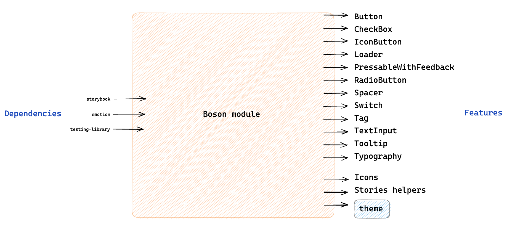

# Boson

## Overview



Each component is separated from its style. The style is located in the theme folder, and is strongly related to the implementation of the component. The aim is that if you change the component implementation you'll also have to change the structure of the style object. If you need to change the style of a component, you don't have to go to the component file, you can change everything in the theme.
});

For each component, the associated style is held by a file with the same name in the theme folder. The style can be retrieved via the useTheme hook. If you want to access the radioButton style, you can have it with `theme.radioButton`

## Requirements

- [TypeScript](../../../../bootstrap-docs/gestures/typescript/typescript.md)
- [React Native Testing Library](../../../../bootstrap-docs/gestures/test/testing-library-react-native/testing-library-react-native.md)
- [Custom snapshots](../../../../bootstrap-docs/gestures/test/custom-snapshots.md)

## Usage

1. Clone the enablers repo in a temporary folder.

   ```bash
   git clone git@github.com:bamlab/react-native-enablers.git $TMPDIR/react-native-enablers
   ```

1. Copy past `modules/boson` folder in your project, for example `src/shared/view`.

   ```bash
   mkdir -p ./src/shared/view
   rsync -av --exclude={'README.md','boson.png'} $TMPDIR/react-native-enablers/warehouse/src/modules/boson/ ./src/shared/view
   ```

1. Install dependencies:

   ```bash
   yarn add @emotion/react @emotion/native expo-font react-native-svg
   # For bare React Native
   npx pod-install
   ```

1. If you need the Switch component, install Reanimated:

   ```bash
   yarn add react-native-reanimated
   # For bare React Native
   npx pod-install
   ```

   ```js
   // babel.config.js
   {
     plugins: [
      'react-native-reanimated/plugin',
     ],
   }
   ```

1. Resolve [the import aliases](../../../../bootstrap-docs/gestures/imports/options/path_aliases.md):

   - `"../.."` → `"./src/shared/view"`
   - `"#testing"` → `"./src/testing"`

   If you prefer standard `#shared/view` imports instead of the `../..` alias, use:

   ```bash
   grep -rl \../.. ./src/shared/view | xargs sed -i '' -e 's/../../#shared\/view/g'
   ```

1. Provide the theme and fonts in `App.tsx`:

   ```tsx
   // App.tsx

   import {ThemeProvider} from '@emotion/react';
   import {useFonts} from 'expo-font';
   import {fontFiles} from '../../theme/fonts';
   import {theme} from '../../theme/theme';

   const App = () => {
     const [fontsLoaded] = useFonts(fontFiles);
     if (!fontsLoaded) {
       return null;
     }

     return (
       <ThemeProvider theme={theme}>
         {/* ... wrap other providers ... */}
       </ThemeProvider>
     );
   };
   ```

1. Provide the theme in tests

   ```tsx
   // src/testing/render.tsx

   import {ThemeProvider} from '@emotion/react';
   import {theme} from '../../theme/theme';

   // ... wrap children in the custom renderer ...
   <ThemeProvider theme={theme}>{children}</ThemeProvider>;
   // ...
   ```

1. Either install storybook (see below) or remove all the code related to storybook by running the following script

   ```bash
   find . -type f -name "*.stories*" -exec rm -f {} \;
   find . -type d -name "storybook" -exec rm -rf {} \;
   ```

1. Adapt it to fit your design system by following this [doc](./docs/adaptBoson.md)

1. ⚠️ Add your feedbacks to this [database](https://www.notion.so/m33/469e439795494c498cde0fe85d244423?v=6e50f09283434d01a11654887206da6c). It will help us to improve 🙏

## Storybook

The storybook is a small app that shows you your components look like. If you want to set up the storybook, here is [how to do it](../../../../bootstrap-docs/gestures/storybook/storybook.md)
